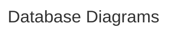

# Math Sorcerer’s Scraper

<details open>
  <summary><h2>Git Commit Message Conventions</h2></summary>

Conventional Commit is a formatting convention that provides a set of rules to formulate a consistent commit message structure like so:

```
<type>[optional scope]: <description>
[optional body]
[optional footer(s)]
```

Commit types include the following...
- `feat` – a new feature is introduced with the changes
- `fix` – a bug fix has occurred
- `chore` – changes that do not relate to a fix or feature and don't modify src or test files (for example updating dependencies)
- `refactor` – refactored code that neither fixes a bug nor adds a feature
- `docs` – updates to documentation such as a the README or other markdown files
- `style` – changes that do not affect the meaning of the code, likely related to code formatting such as white-space, missing semi-colons, and so on.
- `test` – including new or correcting previous tests
- `perf` – performance improvements
- `ci` – continuous integration related
- `build` – changes that affect the build system or external dependencies
- `revert` – reverts a previous commit
  
| Gitmojis                                  |            |                                                          |              |                                          |          |                                                                 |            |
|-------------------------------------------|------------|----------------------------------------------------------|--------------|------------------------------------------|----------|-----------------------------------------------------------------|------------|
| 🎨 Improve structure / format of the code. | `style`    | 📌 Pin dependencies to specific versions.                 | `chore`      | ♿ Improve accessibility.                 | `feat`   | 🚩 Add, update, or remove feature flags.                         | `docs`     |
| ⚡ Improve performance.                    | `perf`     | 👷 Add or update CI build system.                         | `ci`         | 💡 Add or update comments in source code. | `docs`   | 🥅 Catch errors.                                                 | `fix`      |
| 🔥 Remove code or files.                   | `refactor` | 📈 Add or update analytics or track code.                 | `dev`        | 🍻 Write code drunkenly.                  | `drunk`  | 💫 Add or update animations and transitions.                     | `dev`      |
| 🐛 Fix a bug.                              | `fix`      | ♻️ Refactor code.                                         | `refactor`   | 💬 Add or update text and literals.       | `dev`    | 🗑️ Deprecate code that needs to be cleaned up.                   | `refactor` |
| 🚑 Critical hotfix.                        | `fix`      | ➕ Add a dependency.                                      | `chore`      | 🗃️ Perform database related changes.      | `dev`    | 🛂 Work on code related to authorization, roles and permissions. | `dev`      |
| ✨ Introduce new features.                 | `feat`     | ➖ Remove a dependency.                                   | `chore`      | 🔊 Add or update logs.                    | `docs`   | 🩹 Simple fix for a non-critical issue.                          | `fix`      |
| 📝 Add or update documentation.            | `docs`     | 🔧 Add or update configuration files.                     | `chore`      | 🔇 Remove logs.                           | `docs`   | 🧐 Data exploration/inspection.                                  | `dev`      |
| 🚀 Deploy stuff.                           | `deploy`   | 🔨 Add or update development scripts.                     | `dev`        | 👥 Add or update contributor(s).          | `docs`   | ⚰️ Remove dead code.                                             | `refactor` |
| 💄 Add or update the UI and style files.   | `ui`       | 🌐 Internationalization and localization.                 | `feat[lang]` | 🚸 Improve user experience / usability.   | `dev`    | 🧪 Add a failing test.                                           | `test`     |
| 🎉 Begin a project.                        | `genesis`  | ✏️ Fix typos.                                             | `fix`        | 🏗️ Make architectural changes.            | `chore`  | 👔 Add or update business logic.                                 | `dev`      |
| ✅ Add, update, or pass tests.             | `test`     | 💩 Write bad code that needs to be improved.              | `dev`        | 📱 Work on responsive design.             | `dev`    | 🩺 Add or update healthcheck.                                    | `dev`      |
| 🔒 Fix security issues.                    | `fix`      | ⏪ Revert changes.                                        | `revert`     | 🤡 Mock things.                           | `dev`    | 🧱 Infrastructure related changes.                               | `chore`    |
| 🔐 Add or update secrets.                  | `fix`      | 🔀 Merge branches.                                        | `merge`      | 🥚 Add or update an easter egg.           | `easter` | 🧑‍💻 Improve developer experience.                                | `dev`      |
| 🔖 Release / Version tag.                 | `release`/`tags`  | 📦 Add or update compiled files or packages.              | `chore`      | 🙈 Add or update a .gitignore file.       | `chore`  | 💸 Add sponsorships or money related infrastructure.             | `feat`     |
| 🚨 Fix compiler / linter warnings.         | `fix`      | 👽 Update code due to external API changes.               | `refactor`   | 📸 Add or update snapshots.               | `dev`    | 🧵 Add or update code related to multithreading or concurrency.  | `dev`      |
| 🚧 Work in progress.                       | `dev`      | 🚚 Move or rename resources (e.g.: files, paths, routes). | `chore`      | ⚗️ Perform experiments.                   | `dev`    | 🦺 Add or update code related to validation.                     | `dev`      |
| 💚 Fix CI Build.                           | `ci`       | 📄 Add or update license.                                 | `docs`       | 🔍 Improve SEO.                           | `perf`   |                                                                 |            |
| ⬇️ Downgrade dependencies.                 | `chore`    | 💥 Introduce breaking changes.                            | `dev`        | 🏷️ Add or update types.                   | `dev`    |                                                                 |            |
| ⬆️ Upgrade dependencies.                   | `chore`    | 🍱 Add or update assets.                                  | `dev`        | 🌱 Add or update seed files.              | `chore`  |                                                                 |            |
  
</details>


<details open>
  <summary><h2>Data Garage Branching Guidelines</h2></summary>

```mermaid

---
title: Data Garage Branching Guidelines
---
  
gitGraph
    commit
    branch "release"
    checkout "main"
    commit
    branch "feature/feature-A"
    commit
    commit
    commit
    checkout "main"
    merge "feature/feature-A"
    branch "feature/feature-B"
    checkout "feature/feature-B"
    commit
    commit
    checkout "main"
    merge "feature/feature-B"
    branch "bugfix/bugfix-A"
    commit
    checkout "main"
    merge "bugfix/bugfix-A"
    checkout "release"
    merge "main"
    checkout "release"
    branch "hotfix/hotfix-A"
    commit
    checkout "release"
    merge "hotfix/hotfix-A"
    checkout "main"
    merge "release"

```
</details>


<details open>
  <summary><h2>Overview of Math Sorcerer Scraper</h2></summary>


</details>


<details open>
  <summary><h2>Database Diagrams</h2></summary>


</details>
