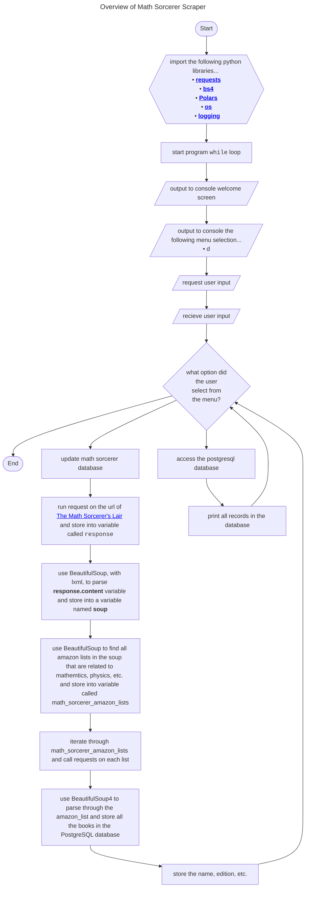
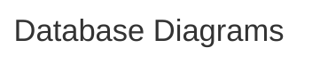

<details>
  <summary>Data Garage Branching Guidelines</summary>

Conventional Commit is a formatting convention that provides a set of rules to formulate a consistent commit message structure like so:

```
<type>[optional scope]: <description>
[optional body]
[optional footer(s)]
```

Commit types include the following...
- `feat` – a new feature is introduced with the changes
- `fix` – a bug fix has occurred
- `chore` – changes that do not relate to a fix or feature and don't modify src or test files (for example updating dependencies)
- `refactor` – refactored code that neither fixes a bug nor adds a feature
- `docs` – updates to documentation such as a the README or other markdown files
- `style` – changes that do not affect the meaning of the code, likely related to code formatting such as white-space, missing semi-colons, and so on.
- `test` – including new or correcting previous tests
- `perf` – performance improvements
- `ci` – continuous integration related
- `build` – changes that affect the build system or external dependencies
- `revert` – reverts a previous commit
  
| Gitmojis                                  |   |                                                          |   |                                          |   |                                                                 |   |
|-------------------------------------------|---|----------------------------------------------------------|---|------------------------------------------|---|-----------------------------------------------------------------|---|
| 🎨 Improve structure / format of the code. |   | 📌 Pin dependencies to specific versions.                 |   | ♿ Improve accessibility.                 |   | 🚩 Add, update, or remove feature flags.                         |   |
| ⚡ Improve performance.                    |   | 👷 Add or update CI build system.                         |   | 💡 Add or update comments in source code. |   | 🥅 Catch errors.                                                 |   |
| 🔥 Remove code or files.                   |   | 📈 Add or update analytics or track code.                 |   | 🍻 Write code drunkenly.                  |   | 💫 Add or update animations and transitions.                     |   |
| 🐛 Fix a bug.                              |   | ♻️ Refactor code.                                         |   | 💬 Add or update text and literals.       |   | 🗑️ Deprecate code that needs to be cleaned up.                   |   |
| 🚑 Critical hotfix.                        |   | ➕ Add a dependency.                                      |   | 🗃️ Perform database related changes.      |   | 🛂 Work on code related to authorization, roles and permissions. |   |
| ✨ Introduce new features.                 |   | ➖ Remove a dependency.                                   |   | 🔊 Add or update logs.                    |   | 🩹 Simple fix for a non-critical issue.                          |   |
| 📝 Add or update documentation.            |   | 🔧 Add or update configuration files.                     |   | 🔇 Remove logs.                           |   | 🧐 Data exploration/inspection.                                  |   |
| 🚀 Deploy stuff.                           |   | 🔨 Add or update development scripts.                     |   | 👥 Add or update contributor(s).          |   | ⚰️ Remove dead code.                                             |   |
| 💄 Add or update the UI and style files.   |   | 🌐 Internationalization and localization.                 |   | 🚸 Improve user experience / usability.   |   | 🧪 Add a failing test.                                           |   |
| 🎉 Begin a project.                        |   | ✏️ Fix typos.                                             |   | 🏗️ Make architectural changes.            |   | 👔 Add or update business logic.                                 |   |
| ✅ Add, update, or pass tests.             |   | 💩 Write bad code that needs to be improved.              |   | 📱 Work on responsive design.             |   | 🩺 Add or update healthcheck.                                    |   |
| 🔒 Fix security issues.                    |   | ⏪ Revert changes.                                        |   | 🤡 Mock things.                           |   | 🧱 Infrastructure related changes.                               |   |
| 🔐 Add or update secrets.                  |   | 🔀 Merge branches.                                        |   | 🥚 Add or update an easter egg.           |   | 🧑‍💻 Improve developer experience.                                |   |
| 🔖 Release / Version tags.                 |   | 📦 Add or update compiled files or packages.              |   | 🙈 Add or update a .gitignore file.       |   | 💸 Add sponsorships or money related infrastructure.             |   |
| 🚨 Fix compiler / linter warnings.         |   | 👽 Update code due to external API changes.               |   | 📸 Add or update snapshots.               |   | 🧵 Add or update code related to multithreading or concurrency.  |   |
| 🚧 Work in progress.                       |   | 🚚 Move or rename resources (e.g.: files, paths, routes). |   | ⚗️ Perform experiments.                   |   | 🦺 Add or update code related to validation.                     |   |
| 💚 Fix CI Build.                           |   | 📄 Add or update license.                                 |   | 🔍 Improve SEO.                           |   |                                                                 |   |
| ⬇️ Downgrade dependencies.                 |   | 💥 Introduce breaking changes.                            |   | 🏷️ Add or update types.                   |   |                                                                 |   |
| ⬆️ Upgrade dependencies.                   |   | 🍱 Add or update assets.                                  |   | 🌱 Add or update seed files.              |   |                                                                 |   |
  
</details>


<details>
  <summary>Data Garage Branching Guidelines</summary>

```mermaid

---
title: Data Garage Branching Guidelines
---
  
gitGraph
    commit
    branch "release"
    checkout "main"
    commit
    branch "feature/feature-A"
    commit
    commit
    commit
    checkout "main"
    merge "feature/feature-A"
    branch "feature/feature-B"
    checkout "feature/feature-B"
    commit
    commit
    checkout "main"
    merge "feature/feature-B"
    branch "bugfix/bugfix-A"
    commit
    checkout "main"
    merge "bugfix/bugfix-A"
    checkout "release"
    merge "main"
    checkout "release"
    branch "hotfix/hotfix-A"
    commit
    checkout "release"
    merge "hotfix/hotfix-A"
    checkout "main"
    merge "release"

```
</details>


<details>
<summary>Overview of Math Sorcerer Scraper</summary>


</details>


<details>
<summary>Database Diagrams</summary>


</details>
