hello

<details>
  <summary>Overview of Math Sorcerer Scraper</summary>

```mermaid

---
title: Data Garage Branching Guidelines
---

gitGraph
    commit
    branch "release"
    checkout "main"
    commit
    branch "feature/feature-A"
    commit
    commit
    commit
    checkout "main"
    merge "feature/feature-A"
    branch "feature/feature-B"
    checkout "feature/feature-B"
    commit
    commit
    checkout "main"
    merge "feature/feature-B"
    branch "bugfix/bugfix-A"
    commit
    checkout "main"
    merge "bugfix/bugfix-A"
    checkout "release"
    merge "main"
    checkout "release"
    branch "hotfix/hotfix-A"
    commit
    checkout "release"
    merge "hotfix/hotfix-A"
    checkout "main"
    merge "release"

```

```mermaid

---
title: Overview of Math Sorcerer Scraper
---

%%{
  init: {
    'theme': 'base',
    'themeVariables': {
      'fontSize': '12px',
      'primaryTextColor': '#000000',
    }
  }
}%%

flowchart TB;
    %% Start and End nodes
    idStart(["Start"]);
    idEnd(["End"]);

    %% Importing modules and other libraries
    idImportModules{{"import the following python libraries...\n&#8226; requests\n&#8226 bs4\n&#8226 polars\n&#8226 os\n&#8226 logging"}};

    %% Start program loop
    idStartProgramLoop["start program <code>while</code> loop"];

    %% Console menu processes
    idOutputPrompt[/"output to console welcome screen"/];
    idOutputMenuSelect[/"output to console the following menu selection...\n&#8226 d"/];
    idOutputRequestUserInput[/"request user input"/];
    idRecieveUserInput[/"recieve user input"/];
    idDeterminMenuSelection{"What option did\n the user\n select from\n the menu?"};

    %% Update the math sorcerer database
    idUpdateMathSorcererDatabase["update math sorcerer database"];
    idRequestMathSorcererURL["run request on the following url...  <a href='http://google.com'>link</a> and store into variable called <code>response</code>"]
    idUseBS4to[Use BeautifulSoup, with to parse the <code>response.content</code> variable and store into a variable named soup]

    %% requests
    %% bs4
    %% pandas

    idStart-->idImportModules-->idStartProgramLoop
    idStartProgramLoop-->idOutputPrompt-->idOutputMenuSelect;
    idOutputMenuSelect-->idOutputRequestUserInput-->idRecieveUserInput-->idDeterminMenuSelection-- 1. Update the math sorcerer database -->idUpdateMathSorcererDatabase;idUpdateMathSorcererDatabase-->idRequestMathSorcererURL-->idUseBS4to;
    idDeterminMenuSelection-- 2. Exit -->idEnd;
    
```

</details>

<details>
  <summary>Overview of Math Sorcerer Scraper</summary>


</details>